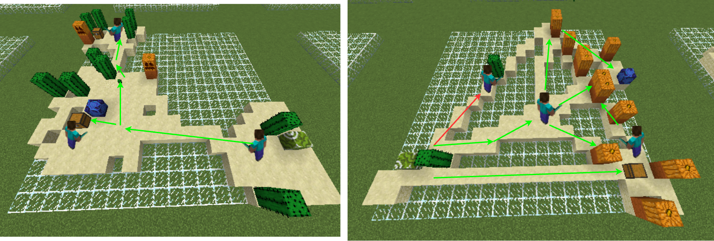

# Hierachical Quality-Diversity for Generating Diverse Video-Game Environments

2024 MSc Individual Research Project based in the [Adaptive and Intelligent Robotics Lab](https://www.imperial.ac.uk/adaptive-intelligent-robotics/) at Imperial College London. We use [Quality-Diversity](https://quality-diversity.github.io) (black-box evolutionary optimization) algorithms as a procedural content generation tool to generate video-game dungeons. 

The dungeon generation process is decomposed in a hierarchical manner, using Quality-Diversity (QD) to independently evolve an archive of **diverse solutions for each component of the dungeon**; i.e. we evolve an archive of diverse dungeon floorplans (structures) and an archive of diverse gameplay networks that place game features such as enemies or treasure. QD is then used again to intelligently sample and combine solutions each from the lower component archives, resulting in a hierarchical archive that can be sampled to generate complete dungeons.

The algorithm is written using [JAX](https://github.com/jax-ml/jax) and [QDax](https://github.com/adaptive-intelligent-robotics/QDax), making use of vectorized transforms to accelerate performance. Minecraft is used as a surrogate for a game engine, via the [Evocraft](https://github.com/real-itu/Evocraft-py) Python interface.

We found this apporach is able to achieve **significant diversity of dungeon structure and gameplay whilst ensuring the dungeons are playable**. Additionally, this approach is **highly modular** and can be easily adjusted and improved by changing the scoring functions in the archives or introducing additional archives to sample from.

<iframe width="560" height="315" src="https://www.youtube.com/watch?v=B5pj8V-GZlIe" allowfullscreen></iframe>

## Improvements / Future Work:

1. **Improve gameplay placement**. This is particularly apparent in the more open levels where placement appears near random with little cohesion. This was investigated and is due to the difference in the training and inference data distribution used to train the gameplay placing networks. An obvious first step would be to try align the distributions more, otherwise possibly moving away from a supervised learning approach.
2. **Increase base width of hierarchy** by introducing additional archives to sample from, e.g. an archive of **different level styles** such as snow, desert, forest etc.., to further increase level diversity.
3. **Scale up** by connecting generated dungeons to create large playable levels.
---